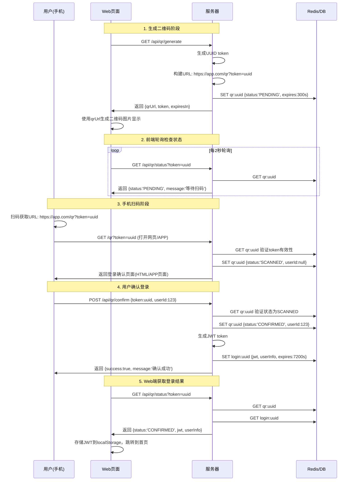

# QR Code Login

## 流程

```mermaid
sequenceDiagram
    participant U as 用户(手机)
    participant W as Web页面
    participant S as 服务器
    participant R as Redis/DB

    Note over W,S: 1. 生成二维码阶段
    W->>S: GET /api/qr/generate
    S->>S: 生成UUID token
    S->>S: 构建URL: https://app.com/qr?token=uuid
    S->>R: SET qr:uuid {status:'PENDING', expires:300s}
    S->>W: 返回 {qrUrl, token, expiresIn}
    W->>W: 使用qrUrl生成二维码图片显示
    
    Note over W,S: 2. 前端轮询检查状态
    loop 每2秒轮询
        W->>S: GET /api/qr/status?token=uuid
        S->>R: GET qr:uuid
        S->>W: 返回 {status:'PENDING', message:'等待扫码'}
    end
    
    Note over U,S: 3. 手机扫码阶段
    U->>U: 扫码获取URL: https://app.com/qr?token=uuid
    U->>S: GET /qr?token=uuid (打开网页/APP)
    S->>R: GET qr:uuid 验证token有效性
    S->>R: SET qr:uuid {status:'SCANNED', userId:null}
    S->>U: 返回登录确认页面(HTML/APP页面)
    
    Note over U,S: 4. 用户确认登录
    U->>S: POST /api/qr/confirm {token:uuid, userId:123}
    S->>R: GET qr:uuid 验证状态为SCANNED
    S->>R: SET qr:uuid {status:'CONFIRMED', userId:123}
    S->>S: 生成JWT token
    S->>R: SET login:uuid {jwt, userInfo, expires:7200s}
    S->>U: 返回 {success:true, message:'确认成功'}
    
    Note over W,S: 5. Web端获取登录结果
    W->>S: GET /api/qr/status?token=uuid
    S->>R: GET qr:uuid
    S->>R: GET login:uuid
    S->>W: 返回 {status:'CONFIRMED', jwt, userInfo}
    W->>W: 存储JWT到localStorage，跳转到首页
```

## 生成二维码

使用 npm 包 [qrcode](https://www.npmjs.com/package/qrcode)