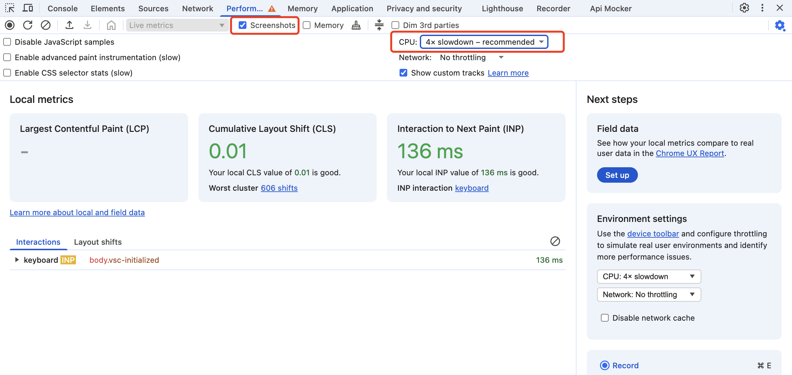
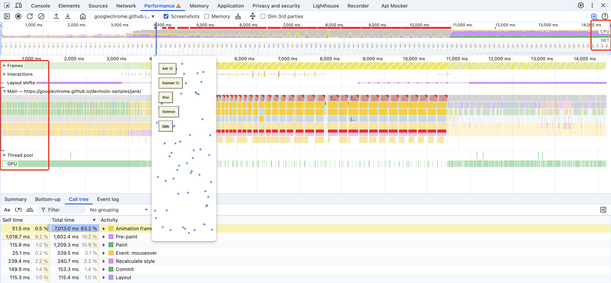
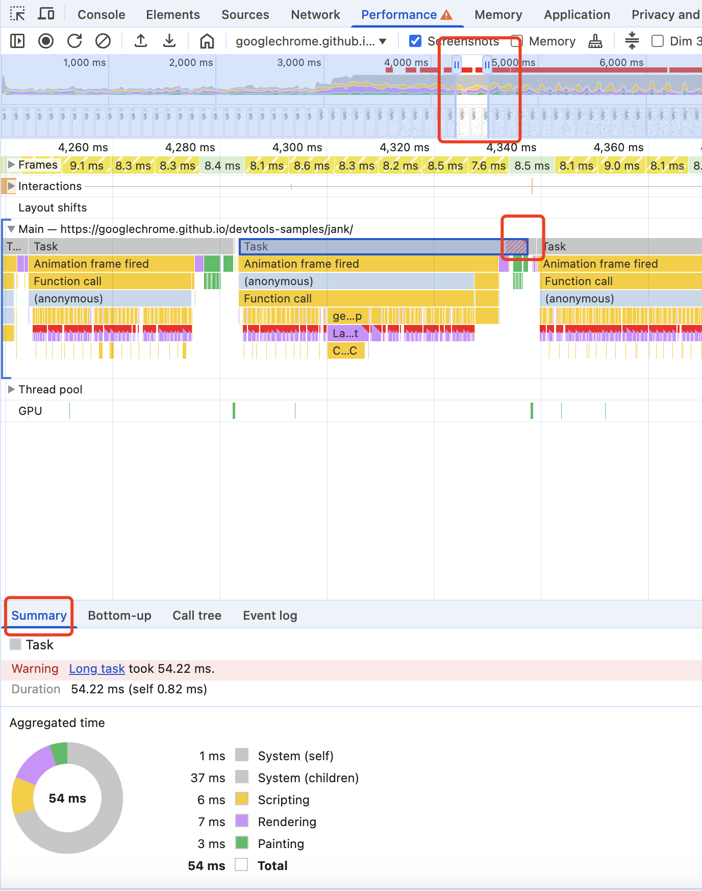
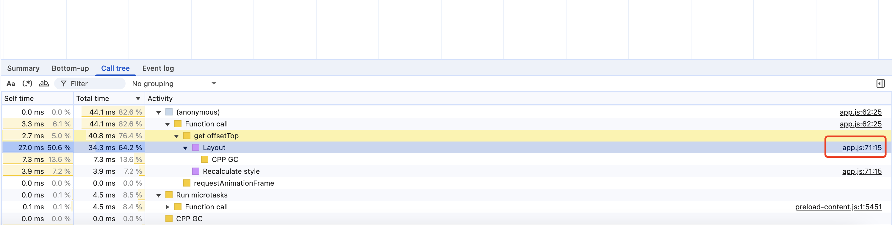
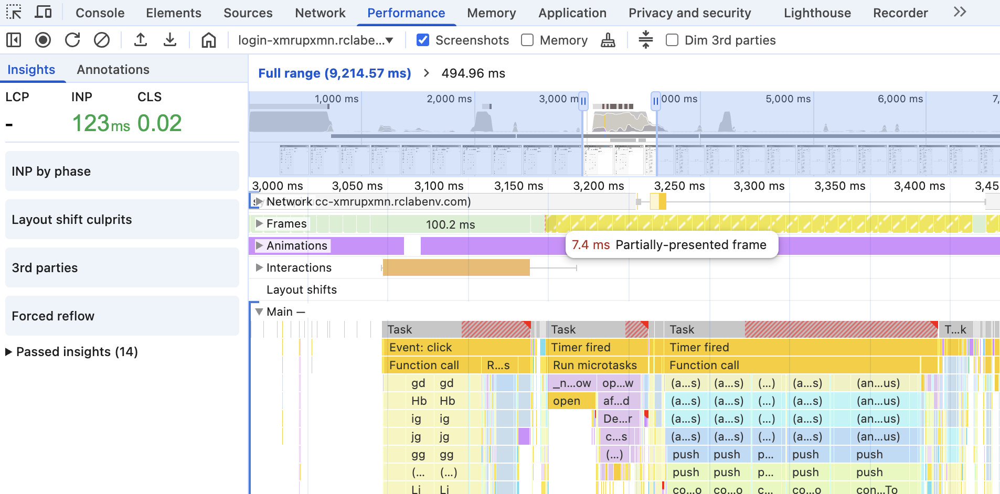
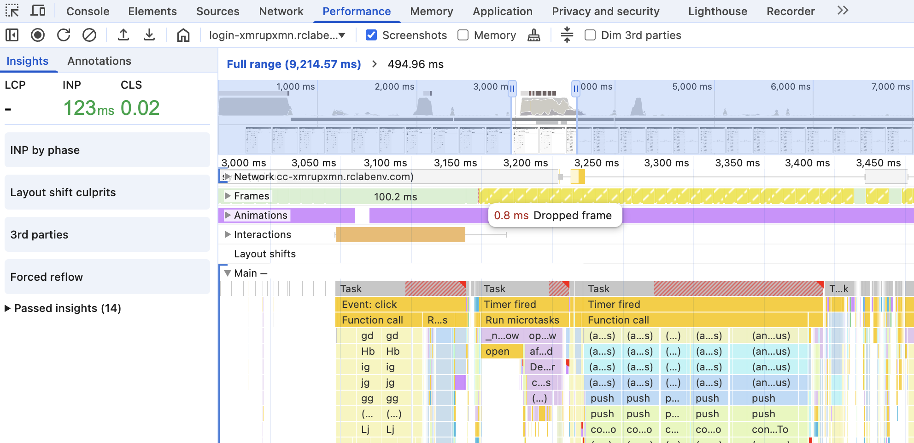
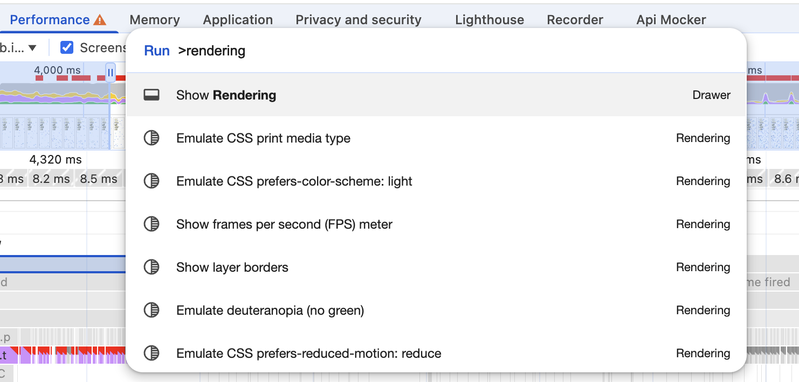
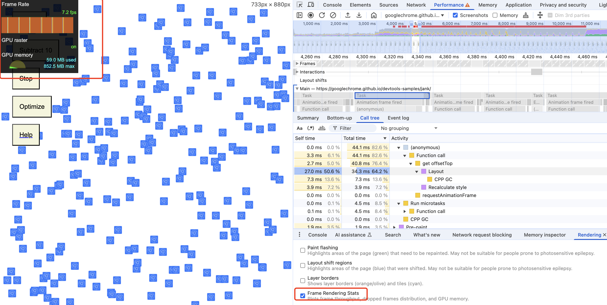

# performance-chrome-debug

[Google Analyze runtime performance](https://developer.chrome.com/docs/devtools/performance)

[Google Analyze runtime performance(zh-CN)](https://developer.chrome.com/docs/devtools/performance?hl=zh-cn)

[Google Demo Link](https://googlechrome.github.io/devtools-samples/jank/)

## Advance

先了解一些浏览器机制

帧与事件循环

- 独立但有关联：帧和事件循环是不同概念，但通过单线程 JS 紧密联系，存在阻塞关系
- 一帧
  - 正常是 16.7ms（60 FPS）
  - 一帧 = N 次事件循环（假设事件循环做的事都比较少） + 样式 + 布局 + 绘制。在这 16.7ms 内，事件循环会持续运行，它会执行 N 次 [宏任务 + 微任务]。然后，在其中某一次循环的末尾，如果 VSync 信号到了，浏览器会决定 “现在渲染！”，然后在那次循环内执行 [rAF 回调 + 样式 + 布局 + 绘制]
- rAF(requestAnimationFrame): 下一帧渲染工作开始之前执行

### Demo

**假设我们在 Frame N 的时间段内：**

1. **事件循环 Tick 1：**
   - 执行一个宏任务 (比如 `setTimeout`)。
   - 执行所有微任务。
   - 浏览器检查：到渲染时间了吗？**还没。**
2. **事件循环 Tick 2：**
   - 执行一个宏任务 (比如用户点击)。**假设这个任务调用了 `requestAnimationFrame(myRafCallback);`**
   - 执行所有微任务。
   - 浏览器检查：到渲染时间了吗？**还没。**
3. **事件循环 Tick 3：**
   - 执行一个宏任务 (比如网络请求返回)。
   - 执行所有微任务。
   - 浏览器检查：到渲染时间了吗？**是的！VSync 信号到了，该渲染 Frame N+1 了！**
   - **开始渲染流程 (仍然在 Tick 3 内)：**
     - **执行 `myRafCallback`** (以及其他所有待处理的 rAF 回调)。
     - 执行样式计算。
     - 执行布局。
     - 执行绘制。
     - 合成并显示 Frame N+1。
4. **事件循环 Tick 4 (现在已经是 Frame N+1 的时间段了)：**
   - 执行下一个宏任务...

### Q&A

Q: 上述 demo 中是否有可能在 Tick2 就收到 VSync 然后直接执行 rAF 回调？

A: 通常不会

- rAF 的调度机制：当调用 requestAnimationFrame(callback) 时，并不是在命令浏览器“立即执行”，而是在请求浏览器：“请在下一次准备绘制新帧时，执行这个 callback”。这个 callback 会被放入一个待处理的回调列表中
- 处理列表的时机：浏览器会在每个 VSync 信号到来、准备渲染新帧时，去处理这个待处理列表。关键在于，它通常会处理在本次事件循环 Tick 开始之前就已经在列表中的回调
- 防止不确定性：如果浏览器允许在同一个 Tick 内调度并立即执行 rAF，可能会导致一些不确定性和循环问题。例如，一个 rAF 回调内部又调用了 rAF，如果立即执行，可能会造成无限循环或难以预测的帧率。目前的模型（调度到下一帧）提供了一个更清晰、更可预测的边界：这一轮的逻辑处理完了，下一轮再处理动画更新
- 批处理： 浏览器倾向于将一帧内的所有 rAF 回调收集起来，在下一帧的渲染开始前一次性执行。如果在 Tick 2 就执行了刚添加的 myRafCallback，就破坏了这种批处理的节奏

## Basic Debugger

- 打开 [Demo](https://googlechrome.github.io/devtools-samples/jank/)

- 勾选 `Screenshots` + `CPU slowdown(确保更好的看到性能瓶颈问题)`

- 点击 `Record` 开始录制，等 2s 后连续点击 `Add 10` 增加页面元素，10s 后点击 Optimize，最后 `Stop` 停止录制

- 生成的 panel 主要信息
  - FPS: FPS 较低会被标红，排查时注意看标红的部分
  - CPU: 图表越高，表示 CPU 在那个时间点越繁忙。不同的颜色堆叠在一起，显示了时间是如何分配给不同类型的任务的
  - NET: 网络请求
  - Frames: 帧
  - Main: 主进程做了什么

- 可以缩放时间区间，点击 Main 中的 Task 可以看 Summary，具体了解各个类型的任务都花了多少时间

- 尤其需要关注 Task 右上角有**红色三角形**标志的，表示是个 **Long Task**

- `Call tree` 可以帮忙排查到 Long task 的代码

## Partially Presented Frame

### Overview

- Dropped Frame: 掉帧，即该帧在浏览器尝试渲染动画或视频时，由于各种原因未能按预期绘制一帧的情况。掉帧会导致动画看起来不流畅，影响用户体验

- Partially Presented Frame: 在 Chrome Performance 面板中，黄色的帧，尤其是标记为 "Partially Presented Frame" 的帧，通常意味着浏览器**尝试**在预定的时间（VSync 信号到来时，大约每 16.7ms 一次）呈现一帧新的画面，但是**失败了或者只成功了一部分**。并不代表“渲染工作只花了一点点时间”。它们更可能代表的是浏览器**一次又一次地尝试**在每个 16.7ms 的时间点去呈现，但**一次又一次地因为主线程被占用而无法完整做到**。它们显示的是**帧的 _间隔_ 或 _尝试_，而不是一帧 _完整_ 的渲染耗时**。它们是**问题**的标志，而不是“快速渲染”的标志

### Q&A

Q: 为什么上图中因为 Task 1 的长任务，导致产生了 100.2ms 的长帧，但 Task 2 也是长任务，却没有是一些 Partially Presented Frame 的短帧？

A:

- **Task 1 的情况 (100.2ms 长帧):**

  - **启动点：** 用户点击 (Click)。这通常意味着用户**期望看到一个即时的视觉反馈**。
  - **JS 执行：** 事件处理程序开始运行。它很可能执行了**大量且直接的 DOM 操作或样式更改**。这些操作本身就是“脏活累活”，它们会**明确地告诉浏览器：“嘿，接下来有大量的渲染工作要做！”**

- **Task 2 的情况 (部分呈现帧):**
  - **启动点：** `Timer fired` 一般是如 `setTimeout` 触发的。这**不一定**意味着有即时的、大量的视觉更新需求。它可能是在做一些背景计算、数据处理，或者是一些不那么紧急的 UI 更新。
  - **JS 执行：** 长长的 JS 任务开始运行。我们假设它**没有**进行像 Task 1 那样大规模、强制性的 UI 更改。
  - **浏览器的常规节奏：** 尽管主线程被阻塞，但浏览器的**渲染调度器**仍然在按照 VSync 信号（大约每 16.7ms 一次）**尝试启动新的渲染周期**。这是它的**本职工作**，它总是希望尽可能地保持 60fps。
  - **尝试与失败：** 每当 VSync 信号到来，调度器说“该渲染了！”，但主线程却回答“我很忙，没空！”。因为主线程被长 JS 任务占用，浏览器无法完成渲染帧所需的所有步骤

## 其他辅助工具

- 按 Command+Shift+P（Mac）或 Control+Shift+P（Windows、Linux）打开“命令”菜单。
- 在命令菜单中开始输入 **Rendering**，然后选择显示渲染。
- 在渲染面板中，启用 `Frame Rendering stats`。视口的右上角会显示一个新的叠加层

