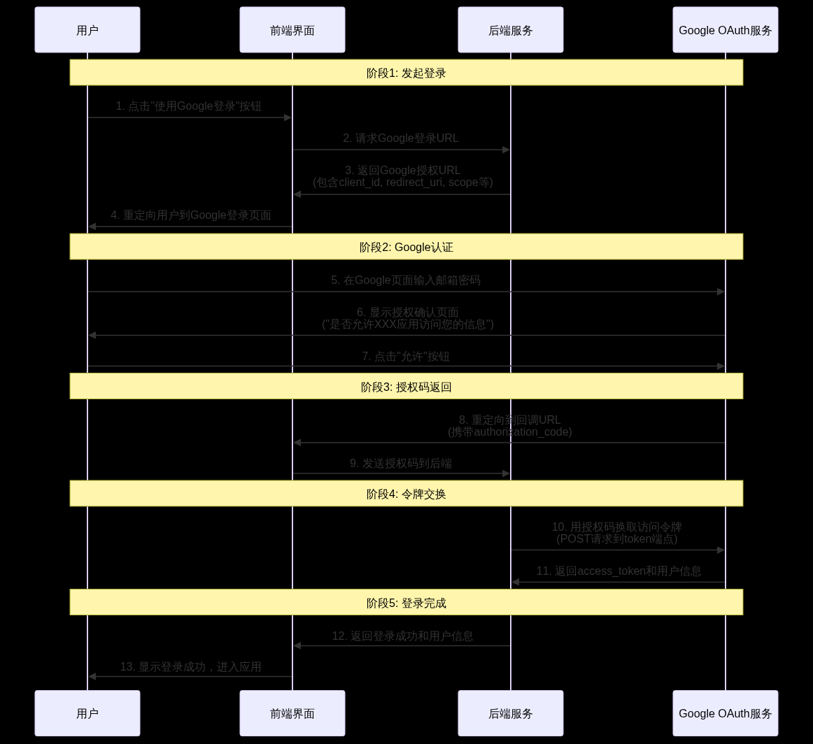
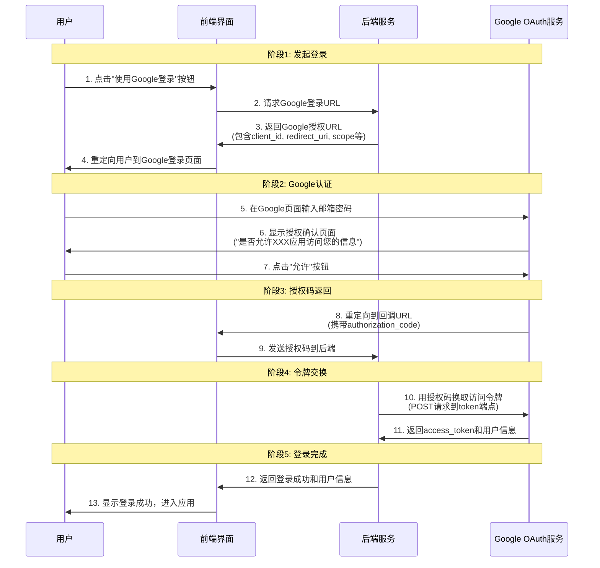

# Single Sign On

以 Google 登录为例

## 流程




### 1. 用户点击登录
- 用户在 `yoursite.com/login` 点击 **Google 登录** 按钮

### 2. 重定向到 Google 登录页面
构造 Google 授权 URL 并重定向用户：

```ts
const handleGoogleLogin = () => {
  // 构造 Google 授权 URL 的参数
  const params = {
    // 组装这个 URL 的步骤可以放前端，也可也放后端
    // 推荐前端直接做了，因为这些 params 不需要特意隐藏
    // client_id 是网站管理员创建 Google cloud 项目时得到的，和 client_secret 一起
    // 但 client_secret 是需要安全保存在后端，client_id 可以放前端，所以可以前端来做这步
    client_id: '123456789-abcdefg.apps.googleusercontent.com',
    redirect_uri: 'https://yoursite.com/auth/google/callback',
    scope: 'openid email profile',
    response_type: 'code',
    state: generateRandomState() // 防 CSRF 攻击
  };
  
  // 构造完整的授权 URL
  const authUrl = 'https://accounts.google.com/o/oauth2/v2/auth?' + 
    new URLSearchParams(params).toString();
  
  // 直接跳转到 Google
  window.location.href = authUrl;
};

const generateRandomState = () => {
  return Math.random().toString(36).substring(2, 15) + 
         Math.random().toString(36).substring(2, 15);
};
```

### 3. Google 用户认证
- 跳转到 `accounts.google.com` (Google 登录页面)
- 用户完成登录和授权
- Google 重定向并带上 **authorization code**

### 4. 处理授权码 (Authorization Code)

#### 方案一：前端处理 ⭐️ **推荐**
**流程：**
1. 重定向到 `https://yoursite.com/auth/google/callback?code=4/0AX4XfWi...&state=abc123xyz789`，显示前端页面
2. 前端请求后端接口，传递 `code` 给后端
3. 后端将 `code` 给 Google 换取 token 和用户信息
4. 后端接口返回 `access_token` 和用户信息给前端

**优势：**
- ✅ 重定向次数少，用户体验较好
- ✅ `code` 时效短，安全问题较小
- ✅ 注重前后端分离

#### 方案二：后端处理
**流程：**
1. 重定向到 `https://yoursite.com/auth/google/callback?code=4/0AX4XfWi...&state=abc123xyz789`，被后端路由捕获
2. 用户看到空白页面，因为这是 API 站点
3. 后端将 `code` 给 Google 换取 token 和用户信息
4. 重定向到前端页面并带上 `access_token` 和用户信息给前端（或者先不返回这些敏感信息，重定向到前端再单独请求接口获取）

**特点：**
- ✅ 某些方案下更安全
- ❌ 重定向次数多，用户体验较差

### 5. 后端换取 Google Access Token

**请求：** `POST https://oauth2.googleapis.com/token`

**请求参数：**
```json
{
  "grant_type": "authorization_code",
  "code": "4/0AX4XfWi...",
  "client_id": "123456789-abcdefg.apps.googleusercontent.com",
  "client_secret": "GOCSPX-xxxxxxxxxxxxxxxxxxxxxxxx",
  "redirect_uri": "https://yoursite.com/auth/google/callback"
}
```

**返回数据：**
```json
{
  "access_token": "ya29.a0AfH6SMC...",
  "expires_in": 3599,
  "refresh_token": "1//04...",
  "token_type": "Bearer"
}
```

### 6. 后端获取用户信息

**请求：** `GET https://www.googleapis.com/oauth2/v2/userinfo`  
**请求头：** `Authorization: Bearer {access_token}`

**返回数据：**
```json
{
  "id": "123456789",
  "email": "user@gmail.com",
  "name": "John Doe",
  "picture": "https://lh3.googleusercontent.com/..."
}
```

## 配置要求

### 1. 创建项目
- 访问 [Google Cloud Console](https://console.cloud.google.com/)
- 创建新项目或选择现有项目

### 2. 启用 Google+ API
- 在 **API 库** 中启用 `Google+ API` 或 `People API`

### 3. 创建 OAuth 2.0 客户端 ID
- 导航到：**凭据** → **创建凭据** → **OAuth 2.0 客户端 ID**
- 应用类型选择：**Web 应用**

### 4. 设置授权重定向 URI
**原因：** 虽然跳转登录时也会带 `redirect_uri` 参数，但 Google Cloud Console 中预先配置的 URI 相当于**白名单**，Google 会验证两者是否匹配，实现双重安全验证

**示例：** `https://yoursite.com/auth/google/callback`

**回调格式：** `https://yoursite.com/auth/google/callback?code=4/0AX4XfWi...&state=xyz`

### 5. 获取关键信息
- **`client_id`**: 公开的客户端标识符
- **`client_secret`**: 保密的客户端密钥 (仅后端使用)

### 配置示例
```json
{
  "client_id": "123456789-abcdefg.apps.googleusercontent.com",
  "client_secret": "GOCSPX-xxxxxxxxxxxxxxxxxxxxxxxx",
  "redirect_uris": ["https://yoursite.com/auth/google/callback"],
  "scope": ["openid", "email", "profile"]
}
```
